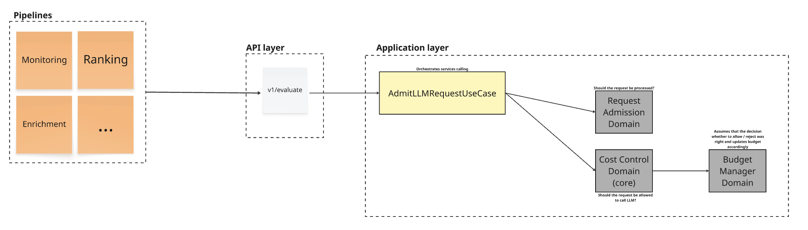

# the-bouncer

## Table of contents
- [System approach](#system-approach)
  - [The flow](#the-admission-flow)
  - [Testing strategy](#testing-strategy)
- [Assumptions](#assumptions--limitations)
- [How to run](#how-to-run)

## System Approach

The application is built using **Domain-Driven Design (DDD)** principles. To keep the codebase lean and maintainable, I’ve balanced strict abstraction with practical simplicity, avoiding "interface overkill" while keeping core logic isolated.

### The Admission Flow

The `admission` module acts as our primary orchestrator, coordinating three key domain services:

* **Validation (Request Admission Domain):** Hashes incoming requests and stores them in a short-lived, app-level cache. This prevents "retry storms" from exhausting the budget when identical requests hit the pipeline in rapid succession.
* **Policy (Cost Control Domain):** The "brain" of the system. It determines whether a request should be allowed based on current usage. It uses a locking mechanism to ensure thread safety and prevent race conditions.
* **Budget Manager (Budget Manager Domain):** Responsible for managing budget snapshots and persisting updates.

### Testing Strategy

I implemented a multi-layered testing suite to ensure reliability without sacrificing development speed:

* **Unit Tests:** In the `policy` and `budget_manager` modules, where the critical business logic resides.
* **End-to-End (E2E) Tests:** Comprehensive scenarios covering various budget exhaustion levels, priorities (P0/P1/P2), and "heavy" requests that consume 10-20% of the budget at once.
* **Concurrency Test:** A dedicated "overspend" test to verify system consistency under heavy load. This ensures that if we migrate from in-memory storage to Redis or Postgres, the safety mechanisms remain intact.

---

## Assumptions & Limitations

To keep the service lightweight and focused, I made the following design choices:

### Priority & Token Estimation

* **Fixed Priorities:** Currently supports **P0, P1, and P2**. The architecture is extensible for more levels if needed.
* **Estimate-First Logic:** The system optimizes for cost-spike prevention rather than exact token counting. This reduces infrastructure overhead and avoids extra dependencies. If higher precision is required later, we can add a "feedback" endpoint to report actual token usage post-execution.

### Refinements for Future Iterations

Due to the initial scope, the following "pro-tier" features were omitted but could be added later:

* **Request Revocation:** The ability to "kill" active low-priority (P1/P2) tasks if a critical P0 request arrives while the budget is full.
* **Budget Shifting:** Allowing a depleted budget (e.g., "monitoring") to borrow from a surplus budget (e.g., "enrichment").

### Error Handling: "Fail Open"

The service is currently configured to **fail open**. If the admission service encounters an error or goes down, the pipeline defaults to allowing the request.

* **Priority:** Business continuity.
* **Alternative:** A "fail closed" approach would prioritize budget safety but could halt all pipeline processing if the service is unreachable.

---

## How to run

### With task
1. [Install task](https://taskfile.dev/docs/installation)
2. Run service `task run-service`
3. Run E2E tests (service must be up) `task run-e2e-tests`
4. Run concurrent overspend test `task run-concurrent-overspend-test`

### Without task
1. Run service `docker compose up`
2. Run E2E tests (service must be up) `python3 -m tests.e2e`
3. Run concurrent overspend test `python3 -m tests.test_concurrent_overspend`